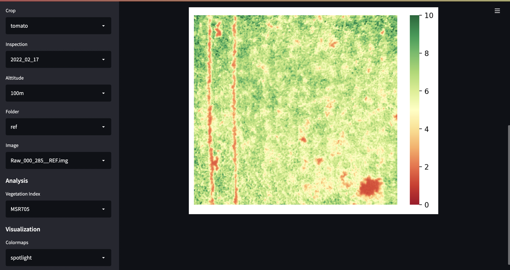
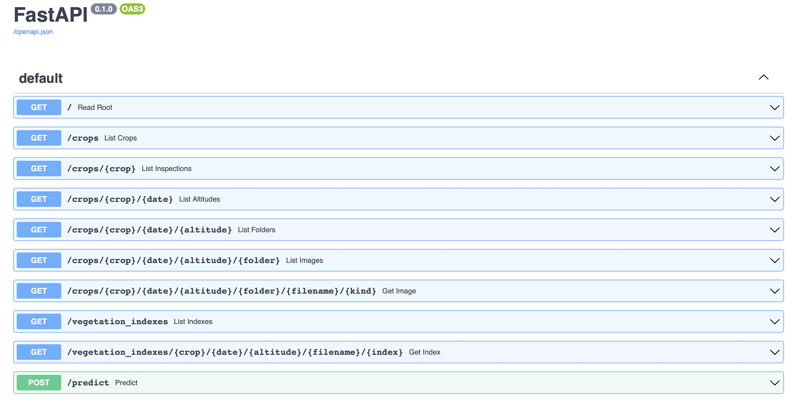

# Vegetation API
### Hyperspectral indexes calculation



**API that apply vegetation indexes onto hyperspectral images**

The ability to measure the intensity of electromagnetic radiation in different wavelength ranges, after its interaction with the material, is the cornerstone of remote monitoring and image spectroscopy. These interactions, when evaluated either through the analysis of the reflection, absorption or transmission of radiation, make it possible to determine what is known as the spectral signature of the material in question. Vegetation also interacts in a particular way with solar radiation. It absorbs a lot in blue and red, and reflects intensely at near-infrared (NIR) wavelengths. Measuring these variations and the way they are related can contribute to a better assessment of the phytosanitary status of crops. These relationships are often described as vegetation indices (VIs). 

24 indices were selected, firstly, taking into account the detection range of a VNIR camera (400nm-1000nm), and secondly, for their robustness, scientific basis and applicability. Additionally, A custom vegetation index was created, called VVI, to increase sensitivity in the various stages of plant development and reach a high level of accuracy in the detection of anomalies.

## How-to

Clone the repo, open a terminal and go to directory. Just run:

---
```markdown
docker compose up -d
```
---

depending on docker compose version you are using, you may need to write `docker-compose` instead. The command `up` will build both containers and put them up and running, the `-d` runs the command in detached mode.
You may write now in the same terminal, the command `docker compose ps` to check the active services.

A dashboard has been added to enable you to explore the api and you start exploring your awesome data! 
The dashboard was made using streamlit and it is exposed in port 8501. Just open a browser and write:

---
```markdown
localhost:8501
```
---

The data folder follows the api structure. The API is exposed in port 8000. You may consult the docs:

---
```markdown
localhost:8000/docs
```
---



NOTE: this project used data in .cue format (BSQ interlieve) that was previously converted to .img(BIP interlieve) along with some metadata (methods available) as follows

ENVI\
samples = 410\
lines = 410\
bands = 164\
header offset = 0\
file type = ENVI Standard\
data type = 4\
interleave = bip\
byte order = 0\
timestamp = 2021-10-21 11:49:07.750000\
exposure = 5\
wavelength = { 350 , 354 , 358 , 362 , 366 , 370 , 374 , 378 , 382 , 386 , 390 , 394 , 398 , 402 , 406 , 410 , 414 , 418 , 422 , 426 , 430 , 434 , 438 , 442 , 446 , 450 , 454 , 458 , 462 , 466 , 470 , 474 , 478 , 482 , 486 , 490 , 494 , 498 , 502 , 506 , 510 , 514 , 518 , 522 , 526 , 530 , 534 , 538 , 542 , 546 , 550 , 554 , 558 , 562 , 566 , 570 , 574 , 578 , 582 , 586 , 590 , 594 , 598 , 602 , 606 , 610 , 614 , 618 , 622 , 626 , 630 , 634 , 638 , 642 , 646 , 650 , 654 , 658 , 662 , 666 , 670 , 674 , 678 , 682 , 686 , 690 , 694 , 698 , 702 , 706 , 710 , 714 , 718 , 722 , 726 , 730 , 734 , 738 , 742 , 746 , 750 , 754 , 758 , 762 , 766 , 770 , 774 , 778 , 782 , 786 , 790 , 794 , 798 , 802 , 806 , 810 , 814 , 818 , 822 , 826 , 830 , 834 , 838 , 842 , 846 , 850 , 854 , 858 , 862 , 866 , 870 , 874 , 878 , 882 , 886 , 890 , 894 , 898 , 902 , 906 , 910 , 914 , 918 , 922 , 926 , 930 , 934 , 938 , 942 , 946 , 950 , 954 , 958 , 962 , 966 , 970 , 974 , 978 , 982 , 986 , 990 , 994 , 998 , 1002 }\
units = nm
